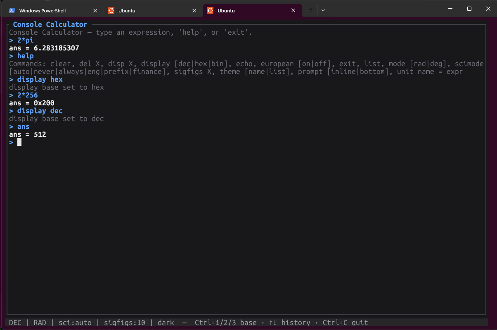

# Console Calculator (ccalc) — modernized

A powerful calculator with a simple **console** interface. Type a math
expression, get an answer, and keep your whole session of past calculations on
screen. It is also a high‑precision scientific calculator, a base converter, and
a units converter — all in one lightweight, single‑binary terminal app.



## A tribute to ZoeSoft's Console Calculator

This project is a loving, from‑scratch homage to **ZoeSoft's Console
Calculator** — an outstanding little program that some of us have relied on
*daily for decades*. Its idea was perfect and ahead of its time: a calculator
that works like a console, where every calculation stays on screen as a
scrollable history, and where you can define your own variables, functions and
units. Nothing else has ever felt as fast or as natural for real work.

This is **not** the original and is **not affiliated with ZoeSoft** — it's an
independent reimplementation built out of admiration, to carry that brilliant
design forward onto modern, 64‑bit systems. All credit for the original concept
and design belongs to ZoeSoft (<http://www.zoesoft.com>). If you can run the
original, do — it's excellent. This version exists so the experience can live on
anywhere a terminal does.

What's new here: rebuilt in **Rust** as a single 64‑bit binary, a modern
terminal UI with themes, even higher precision, and optional **MCP** support so
AI assistants can use it too — while keeping the original's feel intact.

## Why this version

| Goal | How |
| --- | --- |
| **64‑bit, modern language** | Written in Rust (2021 edition). |
| **Lightweight, easy install** | One self‑contained binary, no runtime. `cargo install` or copy the file. |
| **Better UI** | Full‑screen terminal UI (ratatui): scrollback, history recall, live status bar, base shortcuts. |
| **High precision** | 384 bits of working precision (≈115 decimal digits) via `astro-float`. |
| **MCP support (optional)** | `ccalc --mcp` exposes the engine as MCP tools for AI assistants. |
| **Fully tested** | Unit tests for the engine + end‑to‑end tests driving the binary and the MCP server. |

## Install

### Download a prebuilt binary (recommended)

Grab the archive for your platform from the
[**latest release**](https://github.com/gamarilla/ccalculator/releases/latest),
unpack it, and run `ccalc` — it's a single self‑contained binary, no runtime
needed.

| Platform | Asset |
| --- | --- |
| Linux x86‑64 | `ccalc-<version>-x86_64-unknown-linux-musl.tar.gz` |
| Linux ARM64 | `ccalc-<version>-aarch64-unknown-linux-musl.tar.gz` |
| Windows x86‑64 | `ccalc-<version>-x86_64-pc-windows-msvc.zip` |
| macOS Intel | `ccalc-<version>-x86_64-apple-darwin.tar.gz` |
| macOS Apple Silicon | `ccalc-<version>-aarch64-apple-darwin.tar.gz` |

Each archive ships with a `.sha256` checksum file. The Linux builds are
statically linked (musl), so they run on any distro.

```bash
# Example: Linux x86-64
tar -xzf ccalc-*-x86_64-unknown-linux-musl.tar.gz
./ccalc
```

### Install with Cargo

```bash
cargo install --git https://github.com/gamarilla/ccalculator ccalc
```

### Build from source

```bash
# produces a single binary at target/release/ccalc
cargo build --release
./target/release/ccalc
```

## Usage

```text
ccalc                     Launch the interactive terminal UI
ccalc --repl              Simple line REPL (pipe-friendly)
ccalc -e "<expr>"         Evaluate one expression and print the result
ccalc <script> [-o out] [-q]   Run a script file
ccalc --mcp               Run as an MCP server over stdio
ccalc --no-store          Do not load/save persistent state
ccalc --help              Full help
```

Examples:

```bash
ccalc -e "2*pi"                 # ans = 6.283185307
echo "70 mi/h -> m/s" | ccalc --repl
ccalc calc.txt -o results.txt   # run a script, save the session
```

## Features (parity with the original, plus modern touches)

### Calculator basics
- Type an expression, press Enter, get `ans = …`.
- `ans` always holds the previous result; start a line with `+ * / ^` to prepend it (and `--` becomes `ans -`).
- Multiple statements per line separated by `;`. A trailing `;` suppresses that statement's output (handy in scripts).
- `↑`/`↓` recall previous entries.

### Operators
`+ - * /`, `^` (power), `%` (modulo), `!` (factorial), `<< >>` (bit shifts),
`& | @` (bitwise AND/OR/XOR), `< <= > >= == !=` (comparisons), `&& ||` (logical),
parentheses `( )` and `[ ]`. Implicit multiplication is supported (`2pi`, `10 in`).

### Numbers & precision
- Over 100 significant digits of accuracy.
- Hex (`0xFF`) and binary (`0b1001`) input; octal (`0o17`) too.
- SI prefixes appended to numbers: `5M + 100k → 5100000`.

### Variables & functions
- `m = 25` creates a variable; `pi` and `e` are predefined.
- `par(x,y) = x*y/(x+y)` defines a function; call it `par(10,10)`.
- User variables, functions and units **persist** between sessions
  (`ccalc_functions.txt` in your config dir).

### Built‑in functions
`sqrt cbrt ln log log2 logN exp sin cos tan asin acos atan sinh cosh tanh
abs round ceil floor trunc mod max min hypot rand` (function names are
case‑insensitive in spirit; trig respects radian/degree mode).

### Base converter
- Display results in decimal, hex, or binary: `display hex` (or `Ctrl‑1` binary,
  `Ctrl‑2` decimal, `Ctrl‑3` hex in the UI).
- Optional 32‑bit (configurable) two's‑complement display for negatives.

### Units converter
- Convert with the `->` operator: `10 in -> cm`, `70 mi/h -> m/s`, `50 N*m -> millijoules`, `10000 m^2 -> acre`.
- Dozens of built‑in units across length, mass, time, area, volume, force,
  energy, power, pressure, charge, voltage, frequency, and more.
- Define your own: `unit furlong = 201.168 meters`.
- Dimension checking: converting incompatible quantities is an error.

> **Modernization note:** compound units use `*`, `/`, and `^` (e.g. `N*m`,
> `mi/h`, `m^2`). The original's hyphen‑as‑multiply (`N-m`) is replaced by `*`.

### Commands
`clear`/`cls`, `del X` (or `del all`), `disp X`, `display [dec|hex|bin]`,
`echo …`, `european [on|off]`, `exit`, `list`, `mode [rad|deg]`,
`scimode [auto|never|always|eng|prefix|finance]`, `sigfigs N`,
`theme [name|list]`, `prompt [inline|bottom]`, `unit name = expr`, `help`, `gospel`.

### Themes
Switch the UI color theme with the `theme` command; your choice is remembered
between sessions.

- `theme` — show the current theme
- `theme list` — list available themes
- `theme <name>` — switch theme

Built-in themes: **dark** (default) and **light**, plus **nord** (dark) and
**solarized-light**.

### Prompt layout
Choose where you type, with the `prompt` command (remembered between sessions):

- `prompt bottom` (default) — a fixed input box pinned to the bottom.
- `prompt inline` — type at a `>` prompt at the end of the scrollback,
  original‑console style; the bottom box is hidden.
- `prompt` — show the current layout.

### Display options
Scientific‑notation modes (auto / never / always / engineering / engineering‑prefix /
financial), max significant figures, thousands separators, and European
decimal style (swap `.` and `,`).

## MCP support

Run `ccalc --mcp` to expose the calculator over the Model Context Protocol
(newline‑delimited JSON‑RPC 2.0 on stdio). Tools:

- `evaluate(expression)` — evaluate any expression/command; session state persists.
- `convert_units(value, from, to)`
- `convert_base(value, base)`
- `reset()`

Example MCP client config:

```json
{
  "mcpServers": {
    "ccalc": { "command": "ccalc", "args": ["--mcp"] }
  }
}
```

## Project layout

```
crates/
  core/   ccalc-core — the engine (numbers, parser, evaluator, units, formatting)
  cli/    ccalc      — TUI, REPL, script runner, MCP server, persistence
```

## Testing

```bash
cargo test            # unit tests (engine) + end-to-end tests (binary + MCP)
```

## Acknowledgements

Endless thanks to **ZoeSoft** for the original *Console Calculator*
(<http://www.zoesoft.com>) — the inspiration for this project and a tool that has
earned a permanent place in many of our daily workflows. This reimplementation
stands entirely on the shoulders of that original design. For the original
program and its manual, please visit ZoeSoft directly.

## License

MIT — for this reimplementation's source code. "Console Calculator" and the
original program are the work of ZoeSoft; this project is an independent,
unaffiliated tribute.
